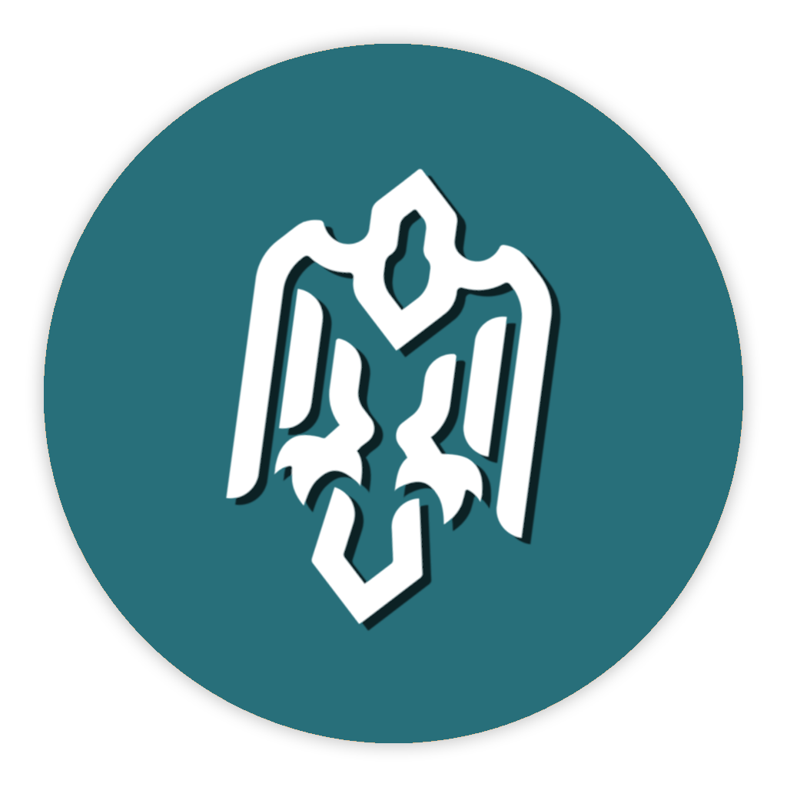

<h1 align="center">
Avian Network [AVN]
<br/><br/>

</h1>

<div align="center">

[](https://avn.network)
[](https://avn.network)

</div>

# What is Avian?

Avian Network is a proof-of-work secured blockchain designed
for efficient and interoperable asset management.
The assets can be automated using Avian Flight Plans allowing the creation of decentralized applications.
The network prioritizes usability, automation, and low fees to make asset minting and management
simple, affordable, and secure. The network's economy runs on AVN, our
native coin that can be mined on a dual algorithm setup using either GPUs
or CPUs.

For more information, as well as an immediately useable, binary version of
the Avian Core software, see https://avn.network

# License

Avian Core is released under the terms of the MIT license. See [COPYING](COPYING) for more
information or see https://opensource.org/licenses/MIT.

# Development

Avian is open source and community driven. The development process is publicly visible and anyone can contribute.

### Branches

- master: _Stable_, contains the code of the latest version.
- dev: _Unstable_, contains new code for planned releases.

The `master` branch is regularly built and tested, but is not guaranteed to be
completely stable. [Tags](https://github.com/AvianNetwork/Avian/tags) are created
regularly to indicate new official, stable release versions of Avian Core.

### Contributing

If you find a bug with this software, please report it using the issue system.

The contribution workflow is described in [CONTRIBUTING.md](CONTRIBUTING.md).

### Running on Testnet

Testnet is up and running and available to use during development. It is recommended to run the testnet using the `-maxtipage` parameter in order to connect to the test network if there has been no recently mined blocks.

Use this command to initially start `aviand` on the testnet: `./aviand -testnet -maxtipage=259200`

### Running on Mainnet

Use this command to start `aviand` (CLI) on the mainnet:
```
./aviand
```

Use this command to start `avian-qt` (GUI) on the mainnet:
```
./avian-qt
```

# Building

Avian Core v5.0 is based on Bitcoin Core v30.2 and uses CMake as its build system.

Further build information is available in the [doc folder](/doc):
- [Build on Linux](doc/build-openbsd.md)
- [Build on macOS](doc/build-osx.md)
- [Build on Windows](doc/build-windows-msvc.md)
- [Build on FreeBSD](doc/build-freebsd.md)
- [Build on OpenBSD](doc/build-openbsd.md)

#### Quick Start (Linux)

```shell
# Install dependencies (Debian/Ubuntu)
sudo apt-get install build-essential cmake pkg-config libevent-dev libboost-dev \
  libsqlite3-dev libqt5gui5 libqt5core5a libqt5dbus5 qttools5-dev qttools5-dev-tools \
  libqrencode-dev libzmq3-dev

# Clone Avian repo
git clone https://github.com/AvianNetwork/Avian
cd Avian

# Build Avian Core
cmake -B build
cmake --build build -j$(nproc)
```

# Testing

Developers are strongly encouraged to write [unit tests](src/test/README.md) for new code, and to
submit new unit tests for old code. Unit tests can be compiled and run with: `ctest --test-dir build`.

There are also [regression and integration tests](/test), written in Python.
These tests can be run with: `build/test/functional/test_runner.py`.

# Avian History

Avian is a digital peer-to-peer network for the facilitation of asset transfer.

Having started development on August 12th of 2021, and active on mainnet since September 1st, Avian (AVN) is a fork of Ravencoin Lite (RVL) which is a fork of Ravencoin Classic (RVC), aimed primarily at bringing the means of development back into the hands of the community after RVC had been abandoned by its creators. With the RVC GitHub locked, and software in disrepair, RVL sought to improve upon the existing foundations by implementing the necessary updates and bug fixes needed to bring the original x16r fork of Ravencoin Classic up to par with modern cryptocurrencies.

We implemented a secondary CPU algorithm, somewhat akin to Myriad (XMY) called MinotaurX which was developed by LitecoinCash (LCC), to help decentralize the mining of AVN without resorting to replacing the primary algorithm.

Thank you to the Bitcoin developers and Ravencoin developers for your hard work. The Avian project is built on the foundation of your efforts and we continue to expand upon it.
